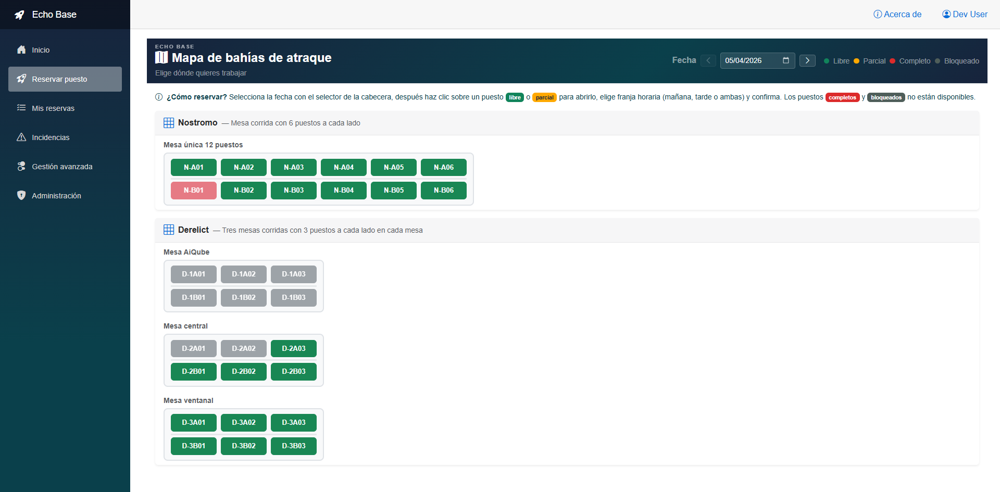
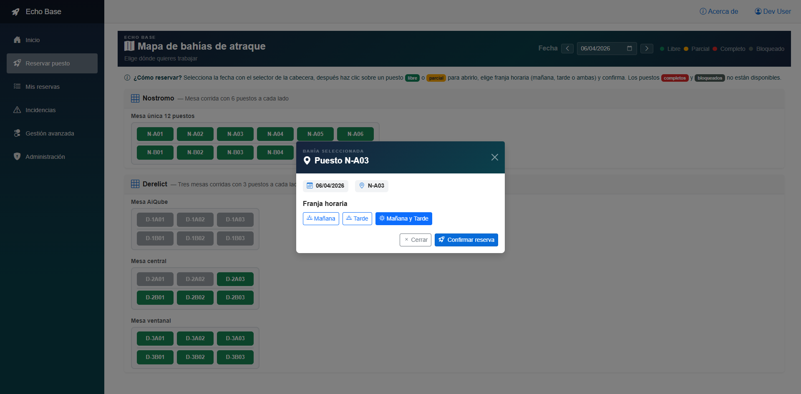
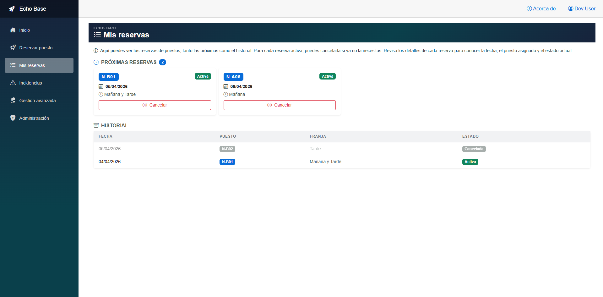
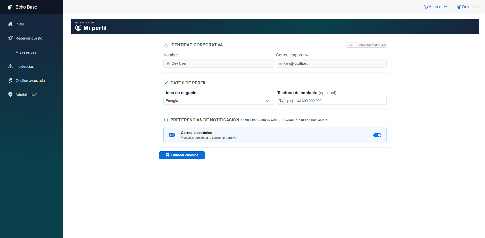
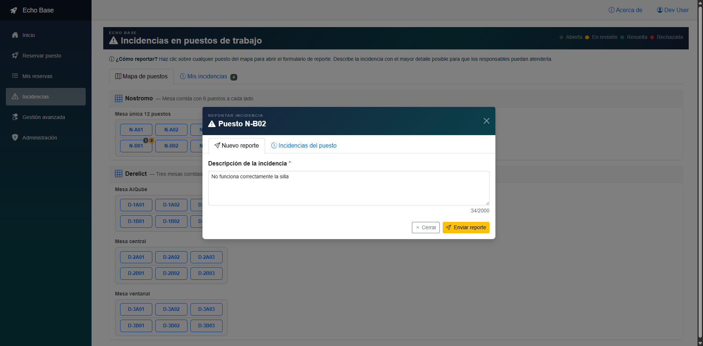
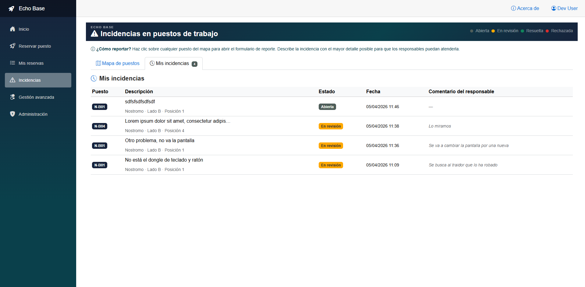

# 🛰️ Manual de Usuario de Echo Base

## 📑 Tabla de contenido

- [Introducción](#📘-introducción)
- [Funcionalidades para todos los usuarios (BasicUsers)](#funcionalidades-para-todos-los-usuarios-basicusers)
  - [🔐 1. Inicio de sesión y acceso](#🔐-1-inicio-de-sesión-y-acceso)
  - [🗺️ 2. Ver el mapa de puestos disponibles](#🗺️-2-ver-el-mapa-de-puestos-disponibles)
  - [📝 3. Crear una reserva](#📝-3-crear-una-reserva)
  - [📅 4. Gestionar tus reservas](#📅-4-gestionar-tus-reservas)
  - [👤 5. Perfil de usuario y preferencias](#👤-5-perfil-de-usuario-y-preferencias)
  - [🚨 6. Reporte de incidencias](#🚨-6-reporte-de-incidencias)
- [Funcionalidades para los usuarios responsables (Managers)](#funcionalidades-para-los-usuarios-responsables-managers)
  - [🧭 1. Acceso a la administración de reservas y bloqueos](#🧭-1-acceso-a-la-administración-de-reservas-y-bloqueos)
  - [⛔ 2. Bloquear puestos de trabajo](#⛔-2-bloquear-puestos-de-trabajo)
  - [🔓 3. Desbloquear puestos](#🔓-3-desbloquear-puestos)
  - [🔍 4. Consulta de impactos sobre reservas existentes](#🔍-4-consulta-de-impactos-sobre-reservas-existentes)
  - [📣 5. Gestión de incidencias como Manager](#📣-5-gestión-de-incidencias-como-manager)
- [Funcionalidades para el administrador del sistema (SystemAdmins)](#funcionalidades-para-el-administrador-del-sistema-systemadmins)
  - [🏗️ 1. Configuración completa de zonas, mesas y puestos](#🏗️-1-configuración-completa-de-zonas-mesas-y-puestos)
  - [🏷️ 2. Edición de metadatos de mesa](#🏷️-2-edición-de-metadatos-de-mesa)
  - [↕️ 3. Reordenar zonas y mesas](#↕️-3-reordenar-zonas-y-mesas)
  - [🛋️ 4. Gestión de puestos de trabajo](#🛋️-4-gestión-de-puestos-de-trabajo)
    - [📜 6. Auditoría y trazabilidad](#📜-6-auditoría-y-trazabilidad)
- [Guía para añadir capturas de pantalla e ilustraciones 🎥](#guía-para-añadir-capturas-de-pantalla-e-ilustraciones-🎥)
- [Buenas prácticas para el uso diario ✨](#buenas-prácticas-para-el-uso-diario-✨)
- [Preguntas frecuentes breves ❓](#preguntas-frecuentes-breves-❓)

## 📘 Introducción

Echo Base es una aplicación interna para gestionar la reserva de puestos de trabajo en entornos híbridos. Está diseñada para que los empleados puedan reservar un puesto para la mañana, la tarde o ambas franjas, y para que los responsables administrativos puedan bloquear y gestionar recursos de forma centralizada.

Este manual está dividido en tres secciones:
- Funcionalidades para todos los usuarios (BasicUsers)
- Funcionalidades para los usuarios responsables (Managers)
- Funcionalidades para el administrador del sistema (SystemAdmins)

> Nota: Esta guía asume que Echo Base está desplegada en un entorno productivo con autenticación corporativa y acceso seguro de usuarios.

## Funcionalidades para todos los usuarios (BasicUsers)

### 🔐 1. Inicio de sesión y acceso

- El inicio de sesión se realiza con el proveedor corporativo configurado.
- El usuario verá su nombre y correo corporativo en la aplicación.
- Los datos de usuario se sincronizan con Azure AD o el servicio de identidad corporativo.

### 🗺️ 2. Ver el mapa de puestos disponibles

- Accede al mapa de puestos desde la página principal o la navegación principal.
- El mapa agrupa los puestos en **Zonas** y cada zona muestra sus mesas y puestos asociados.
- Cada puesto indica el estado:
  - Libre
  - Reservado mañana
  - Reservado tarde
  - Reservado ambas franjas
  - Bloqueado

Mapa de puestos: vista general de disponibilidad

### 📝 3. Crear una reserva

- Selecciona un puesto libre en el mapa.
- Elige la fecha de la reserva.
- Selecciona la franja horaria: `Morning`, `Afternoon` o `Both`.
- El sistema valida:
  - Que el puesto esté disponible en la franja seleccionada.
  - Que el usuario no tenga otra reserva distinta para ese mismo día.
- Confirma la reserva.

#### Qué esperar después
- Verás un resumen de la reserva.
- El puesto cambia de estado en el mapa.
- Recibirás notificaciones por correo.

Formulario de reserva de puesto

### 📅 4. Gestionar tus reservas

- Ve a la página de reservas personales (`MyReservations` o sección similar).
- Consulta tus reservas futuras y pasadas.
- Cancela cualquier reserva activa en cualquier momento.
- Las cancelaciones liberan inmediatamente el puesto para otros usuarios.

Historial de reservas y opciones de cancelación

### 👤 5. Perfil de usuario y preferencias

- Accede a tu perfil desde el menú superior.
- Puedes actualizar:
  - Línea de negocio
  - Teléfono de contacto
- También puedes activar/desactivar preferencias de notificación:
  - Correo electrónico

Perfil de usuario y preferencias

### 🚨 6. Reporte de incidencias

- Dirígete a la sección de incidencias (`/incidencias`).
- Selecciona el puesto de trabajo afectado desde el mapa, incluso si está ocupado o bloqueado.
- Completa el formulario con descripción del problema.
- Envía el reporte.

#### Qué ocurre después
- El reporte se registra en el sistema.
- Los Managers reciben notificación por correo.
- El usuario obtiene confirmación visual.
- Puedes consultar el estado de tus reportes en la sección de "Mis incidencias".

Reporte de incidencia de un puesto

Mis incidencias

---
---

## 🛠️ Funcionalidades para los usuarios responsables (Managers)

### 🧭 1. Acceso a la administración de reservas y bloqueos

- Los Managers tienen acceso a un **cuadro de mando administrativo**.
- Esta vista permite ver el mapa de puestos con información ampliada sobre reservas y bloqueos.
- Las zonas y puestos muestran tooltips con quién reservó cada franja o si están bloqueados.

#### Captura recomendada
- Captura el dashboard de Manager con varias zonas y tooltips abiertos, mostrando el estado de reservas y bloqueos.
- Etiqueta: “Cuadro de mando de Manager”.

### ⛔ 2. Bloquear puestos de trabajo

- Selecciona uno o varios puestos en el mapa.
- Define la fecha o el rango de fechas de bloqueo.
- Introduce el motivo del bloqueo.
- Confirma el bloqueo.

#### Impacto
- Los puestos bloqueados no pueden reservarlos los BasicUsers durante el periodo seleccionado.
- El bloqueo puede ser activado para un día o un período extenso.

### 🔓 3. Desbloquear puestos

- En el mismo tablero se puede ver el estado de bloqueo.
- Selecciona el bloqueo existente y libera el puesto.
- El puesto vuelve a estar disponible para reservas normales.

### 🔍 4. Consulta de impactos sobre reservas existentes

- Antes de confirmar un bloqueo, el sistema muestra las reservas actuales en la franja horaria seleccionada.
- Esto ayuda a conocer el impacto de la acción sobre otros usuarios.

### 📣 5. Gestión de incidencias como Manager

- Los Managers pueden ver todos los reportes de incidencias.
- Pueden actualizar el estado de cada reporte:
  - Abierta
  - En revisión
  - Resuelta
  - Rechazada
- Pueden añadir comentarios de gestión.

#### Captura recomendada
- Captura la pantalla de gestión de incidencias con varios estados visibles y un formulario de actualización.
- Etiqueta: “Gestión de incidencias para Managers”.

---

## ⚙️ Funcionalidades para el administrador del sistema (SystemAdmins)

### 🏗️ 1. Configuración completa de zonas, mesas y puestos

- El SystemAdmin puede crear, editar y eliminar:
  - Zonas de trabajo
  - Mesas dentro de cada zona
  - Puestos de trabajo dentro de cada mesa
- La jerarquía es:
  - Zona → Mesa → Puesto

### 🏷️ 2. Edición de metadatos de mesa

- Para cada mesa se puede asignar:
  - `TableKey` (clave única por zona)
  - `Locator` (texto opcional de localización)
- Si `Locator` queda vacío, el sistema muestra un nombre generado automáticamente.

### ↕️ 3. Reordenar zonas y mesas

- El administrador puede reordenar zonas y mesas mediante drag-and-drop.
- El nuevo orden se persiste inmediatamente y se refleja en el mapa de reservas.

#### Captura recomendada
- Captura la UI de reordenación de zonas o mesas con iconos de agarre visibles.
- Etiqueta: “Reordenación de zonas y mesas”.

### 🛋️ 4. Gestión de puestos de trabajo

- Puedes editar el código del puesto, la ubicación y el equipamiento disponible.
- Eliminar un puesto cancela automáticamente sus reservas futuras y avisa a los usuarios afectados.

### � 5. Auditoría y trazabilidad

- Las acciones de configuración y administración generan registros en el sistema de auditoría.
- Se registra quién realizó la acción, el tipo de cambio y el detalle de la operación.

#### Captura recomendada
- Captura cualquier pantalla de administración avanzada donde se editen zonas, mesas o puestos.
- Etiqueta: “Configuración avanzada de SystemAdmin”.

- Las acciones de configuración y administración generan registros en el sistema de auditoría.
- Se registra quién realizó la acción, el tipo de cambio y el detalle de la operación.

#### Captura recomendada
- Captura cualquier pantalla de administración avanzada donde se editen zonas, mesas o puestos.
- Etiqueta: “Configuración avanzada de SystemAdmin”.

---

## Guía para añadir capturas de pantalla e ilustraciones 🎥

1. Abre la aplicación en el entorno productivo o de preproducción autorizado.
2. Navega a cada sección mencionada en este manual.
3. Captura la pantalla completa o el área relevante:
   - Mapa principal de reservas
   - Modal de reserva
   - Historial de reservas
   - Perfil de usuario
   - Cuadro de mando de Manager
   - Gestión de incidencias
   - Configuración de zonas, mesas y puestos
4. Guarda las imágenes con nombres descriptivos:
   - `01-mapa-reservas.png`
   - `02-modal-reserva.png`
   - `03-historial-reservas.png`
   - `04-perfil-usuario.png`
   - `05-dashboard-manager.png`
   - `06-gestion-incidencias.png`
   - `07-configuracion-zonas.png`
5. Inserta las capturas en la documentación final junto a la sección correspondiente, o añade los enlaces si el manual se publica en un repositorio con `docs/`.

### Ilustraciones sugeridas

- Un diagrama simple de la jerarquía de recursos:
  - Zona → Mesa → Puesto
- Un flujo de reserva básico:
  1. Seleccionar puesto
  2. Elegir franja
  3. Confirmar reserva
  4. Ver reserva en el historial
- Un flujo de bloqueo de Manager:
  1. Seleccionar puestos
  2. Definir fechas
  3. Confirmar bloqueo
  4. Prohibir nueva reserva

> Consejo: Si prefieres no generar imágenes, agrega cuadros de texto con el título de cada captura y una breve descripción en el manual. Esto facilita que cualquier revisor comprenda qué debe aparecer en cada captura.

---

## Buenas prácticas para el uso diario ✨

- Revisa el mapa de disponibilidad antes de reservar para elegir el puesto libre más adecuado.
- Cancela reservas que ya no necesites para liberar espacio a tus colegas.
- Como Manager, bloquea solo los puestos necesarios para evitar reducir la capacidad general innecesariamente.
- Como SystemAdmin, mantén actualizada la estructura de zonas y mesas para que el mapa refleje la oficina real.

## Preguntas frecuentes breves ❓

- ¿Puedo reservar más de una franja en un mismo día? 
  Sí, puedes reservar mañana, tarde o ambas franjas para un mismo puesto, siempre que el puesto esté disponible.

- ¿Puedo cancelar una reserva de última hora? 
  Sí, no hay una restricción de antelación para la cancelación.

- ¿Qué pasa si un puesto está bloqueado? 
  Los BasicUsers no podrán reservarlo en las fechas bloqueadas.

- ¿Puedo reportar un problema en un puesto aunque esté ocupado? 
  Sí, todos los puestos son clicables en la pantalla de incidencias.
