# 🚀 Spec: Sistema de Reserva de Puestos (Hot Desking)

## 📑 Tabla de contenido

- [🎯 Objetivo](#-objetivo)
- [🛠️ Stack técnico](#️-stack-técnico)
- [📐 Convenciones de implementación](#-convenciones-de-implementación)
- [🎨 Diseño y UX (UI Guidelines)](#-diseño-y-ux-ui-guidelines)
  - [🖼️ Galería de Pantallas](#️-galería-de-pantallas-uiux)
- [🗃️ Modelo de datos](#️-modelo-de-datos)
- [🔐 Modelo de autenticación y autorización](#-modelo-de-autenticación-y-autorización)
- [📋 Reglas de negocio generales](#-reglas-de-negocio-generales)
- [👥 Funcionalidad 0: Gestión cuentas de usuario](#-funcionalidad-0-gestión-cuentas-de-usuario-parcialmente-implementada-pendiente-de-configuración-de-acceso-al-tennant-de-azure-ad)
- [⚙️ Funcionalidad 1: Configuración de cuenta de usuario](#️-funcionalidad-1-configuración-de-cuenta-de-usuario-implementada)
- [📌 Funcionalidad 2: Reserva de puesto de trabajo](#-funcionalidad-2-reserva-de-puesto-de-trabajo-implementada)
- [🛡️ Funcionalidad 3: Cuadro de mando para administración](#️-funcionalidad-3-cuadro-de-mando-para-administración-implementada)
- [🗓️ Funcionalidad 4: Gestión de reservas](#️-funcionalidad-4-gestión-de-reservas-implementada)
- [📊 Funcionalidad 5: Reportes y estadísticas](#-funcionalidad-5-reportes-y-estadísticas-pendiente-de-implementación)
- [🔧 Funcionalidad 6: Reporte de incidencias](#-funcionalidad-6-reporte-de-incidencias-en-los-puestos-de-trabajo-pendiente-de-implementación)
- [🚩 Funcionalidad 7: Feature Flags de sistema](#-funcionalidad-7-feature-flags-de-sistema-implementada)
  - [🔔 Flag: TeamsNotificationsEnabled](#-flag-featuresteamsnotificationsenabled)
- [🛠️ Funcionalidad 8: Funciones de administración del sistema](#️-funcionalidad-8-funciones-de-administración-del-sistema-implementada)
- [🧪 Estrategia de pruebas](#-estrategia-de-pruebas)
  - [🔬 Pruebas unitarias](#-pruebas-unitarias-echobasetestsunit)
  - [🔗 Pruebas de integración](#-pruebas-de-integración-echobasetestsintegration)

---

## 🎯 Objetivo
App interna para que 70 empleados reserven 24 puestos físicos, permitiendo cada puesto dos franjas horarias, mañana o tarde.

## 🛠️ Stack técnico
- Framework: .NET 10
- Frontend: Blazor Web App (Interactive Server)
- Estilo: Bootstrap 5 + Bootstrap Icons + CSS scoped por componente
- Persistencia: Entity Framework Core con SQLite (Local) / Azure SQL (Prod)

## 📐 Convenciones de implementación
*   Usa Clean Code y sigue las convenciones de estilo de C#.
*   Aplica principios SOLID y patrones de diseño cuando sea apropiado.
*   Documenta con XML comments y mantén el código legible.
*   Escribe tests para cada nueva funcionalidad o cambio significativo.
*   Utiliza GitHub Copilot Pro para generar código boilerplate, pero siempre revisa y ajusta según el contexto específico del proyecto.
*   Mantén los archivos `spec.md` actualizados para que la IA tenga el contexto necesario para generar código relevante.
*   Clean Architecture: Mantén una separación clara entre las capas de dominio, infraestructura y presentación para facilitar la mantenibilidad y escalabilidad del proyecto.
*   Usa Microsoft.Identity.Web para Blazor Server y Blazor WebAssembly para implementar autenticación y autorización con Azure AD, asegurando que solo los usuarios autorizados puedan acceder a la aplicación y sus funcionalidades.
*   Usa el patrón Mediator para manejar la lógica de negocio y las interacciones entre componentes, promoviendo un código más limpio y desacoplado. Esto facilitará la gestión de comandos y consultas, así como la implementación de nuevas funcionalidades sin afectar otras partes del sistema. Usa la librería MediatR para facilitar la implementación de este patrón en toda la aplicación.
*   Para la capa de acceso a datos, implementa el patrón Repository para abstraer la lógica de acceso a la base de datos y facilitar la gestión de entidades. Esto permitirá una mayor flexibilidad y mantenibilidad del código, ya que las operaciones de acceso a datos estarán centralizadas y desacopladas del resto de la aplicación.
*   **Identificadores de entidad**: Todos los identificadores de entidades de dominio son `Guid` generados como **UUID v7** mediante `Guid.CreateVersion7()` (disponible de forma nativa desde .NET 9). Los UUID v7 incorporan un prefijo de marca de tiempo de 48 bits que los hace ordenables cronológicamente, reduciendo la fragmentación de índices B-tree. La generación se realiza en la capa de aplicación (handlers y behavior de auditoría); EF Core está configurado con `UuidV7ValueGenerator` en las configuraciones Fluent API de cada entidad como mecanismo de fallback. Las entidades de datos maestros con GUIDs determinísticos (`DbSeeder`) quedan excluidas de este mecanismo. `SystemSetting` también queda excluida por tener PK de tipo `string`.

## 🎨 Diseño y UX (UI Guidelines)
Para mantener coherencia en el rediseño y ampliaciones futuras de Echo Base, se establecieron las siguientes bases de UX/UI en el desarrollo interactivo de `Home.razor`, `DockMap.razor`, `MyReservations.razor`, `About.razor` y `UserProfile.razor`:

1. **Cabeceras de página (`eb-page-header`, `eb-hero`)**
   - Dominadas por un gradiente espacial/táctico oscuro: `linear-gradient(135deg, #0d1b2a 0%, #1a3a5c 60%, #0d1b2a 100%)`.
   - Textos en blanco para máximo contraste, integrando subtítulos ligeros tipo "eyebrow" (letras en mayúscula, pequeñas, con tracking/letter-spacing aumentado).
   - En vistas operativas (DockMap), la cabecera acomoda controles compactos (selector de fecha transparente y leyenda simplificada con `span` circulares) para maximizar el espacio vertical útil (above the fold).
   - **CSS Isolation (crítico):** Blazor aplica *scoped CSS*: los estilos definidos en `ComponenteX.razor.css` solo aplican al marcado de ese componente (se compilan con un atributo `b-xxxx` único). Por tanto, **cada nueva página que use `eb-page-header`, `eb-page-eyebrow` u otras clases compartidas debe tener su propio fichero `.razor.css`** con esas definiciones. No basta con que la clase exista en otro componente.

2. **Densidad y Espaciado (Desktop/Mobile)**
   - Elementos *compactos* (`py-2`, `mb-2`, `p-3`) en lugar del espaciado excesivo de Bootstrap por defecto. El objetivo de la interfaz es evitar el scroll vertical o minimizarlo, para que los usuarios vean el contexto visual (ej. el mapa de bahías interactivo) sin tener que desplazarse demasiado.
   - Botones sutiles e inputs con clases como `form-control-sm` o `btn-sm` para interacciones recurrentes.

3. **Uso de Iconografía (Bootstrap Icons)**
   - Iconos integrados sistemáticamente en los títulos de secciones/vistas y en acciones principales (`bi-*` junto a textos como reservas confirmadas, botones de cancelación con *spinners* o símbolos).
   - Modalidades de alerta: uso de alertas (`.alert`) acompañadas de íconos in-line y flexbox (`d-flex align-items-center gap-2`) para feedback de éxito o advertencia en vez de simples bloques de texto monótonos.

4. **Componentización Visual**
   - **Tarjetas sin borde y elevación sutil**: Uso de `.card.border-0.shadow-sm`.
   - **Hover effects táctiles**: Aplicados en tarjetas informativas (reservas futuras) y los puestos del mapa (`.eb-reservation-card:hover`, `.eb-dock-seat:not(:disabled):hover`) usando `transform: translateY(-2px); box-shadow: ...`.
   - **Interacciones enriquecidas (Formularios/Modales)**: Uso moderno de entradas, por ejemplo, convirtiendo opciones en botones (`.btn-check` + `.btn-outline-primary`) en lugar de radio buttons clásicos para mejorar las áreas táctiles en móviles y darle un look moderno.
   - **Datos históricos**: Manejo diferenciado visualmente. Los elementos cancelados o pasados bajan su opacidad y tienen efecto tachado sobre los listados.
   - **Formularios de perfil**: Separación clara entre datos corporativos de solo lectura (gestionados por Azure AD) y datos editables del usuario (línea de negocio, teléfono y preferencias), usando tarjetas diferenciadas, campos compactos y switches visuales para preferencias booleanas.

### 🖼️ Galería de Pantallas (UI/UX)

A continuación se muestran capturas de las pantallas principales del sistema, que reflejan la aplicación de los principios de diseño mencionados:

#### 🏠 1. Home (`Home.razor`)
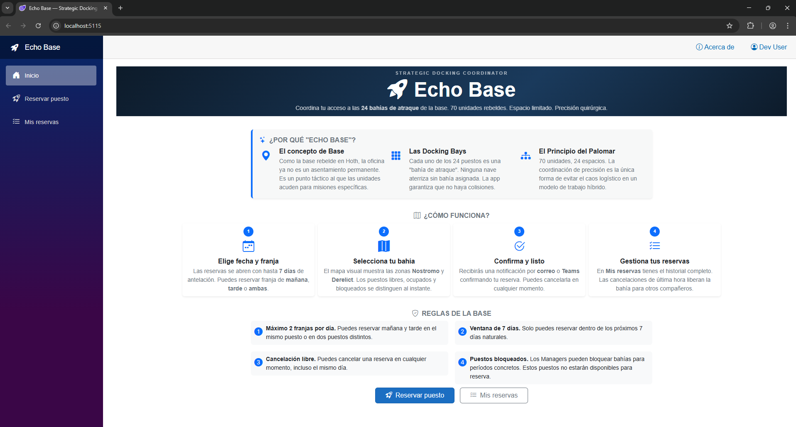

#### 🗺️ 2. Mapa de Bahías (`DockMap.razor`)
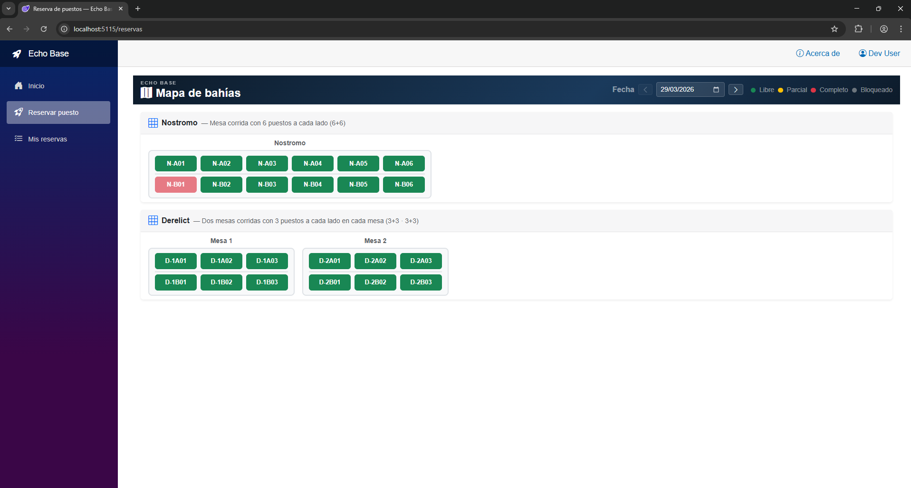

#### 📅 3. Mis Reservas (`MyReservations.razor`)
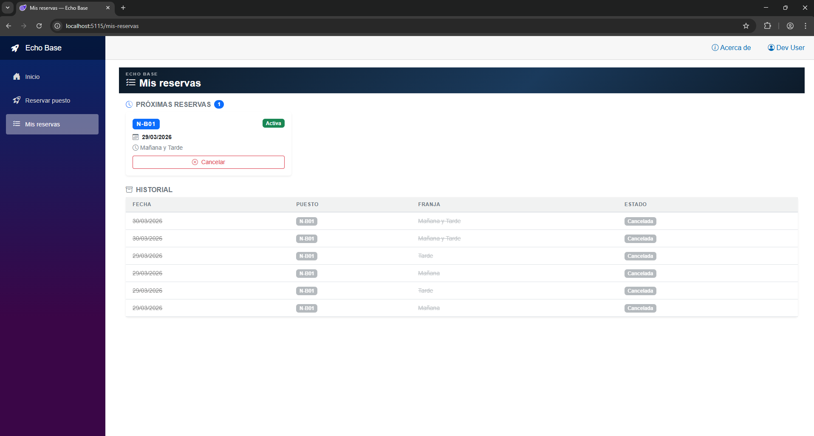

#### ℹ️ 4. Acerca de (`About.razor`)
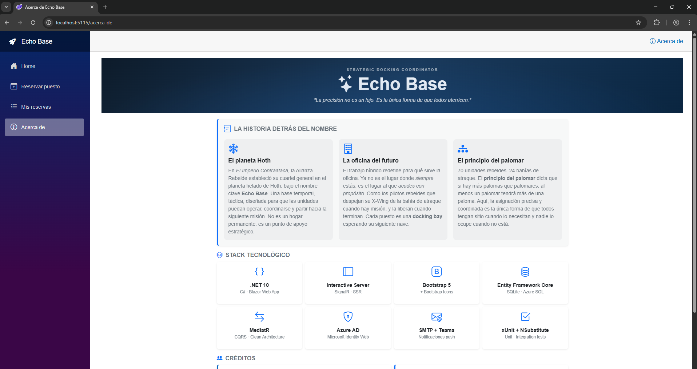
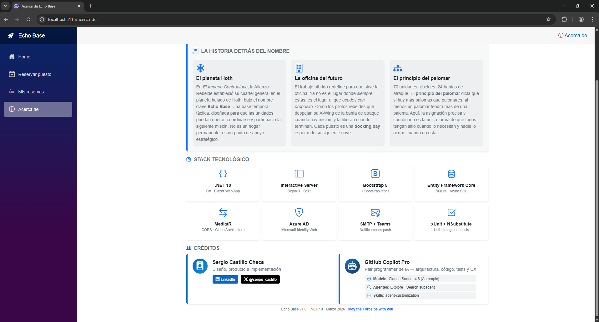

#### 👤 5. Perfil de Usuario (`UserProfile.razor`)
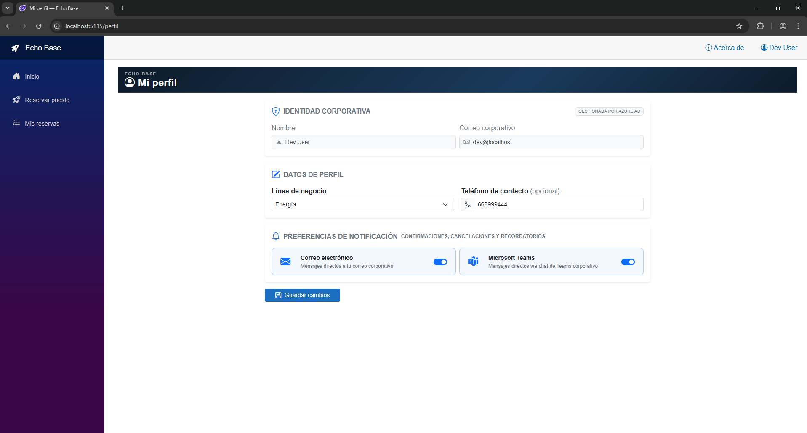

#### 🛡️ 6. Administración del Sistema (`SystemAdminDashboard.razor`)

##### 🔧 Modo Mantenimiento
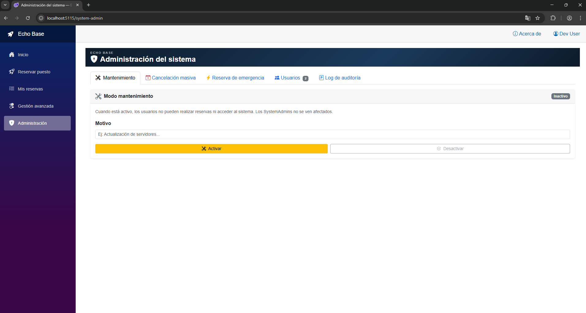

##### 🗑️ Cancelación Masiva
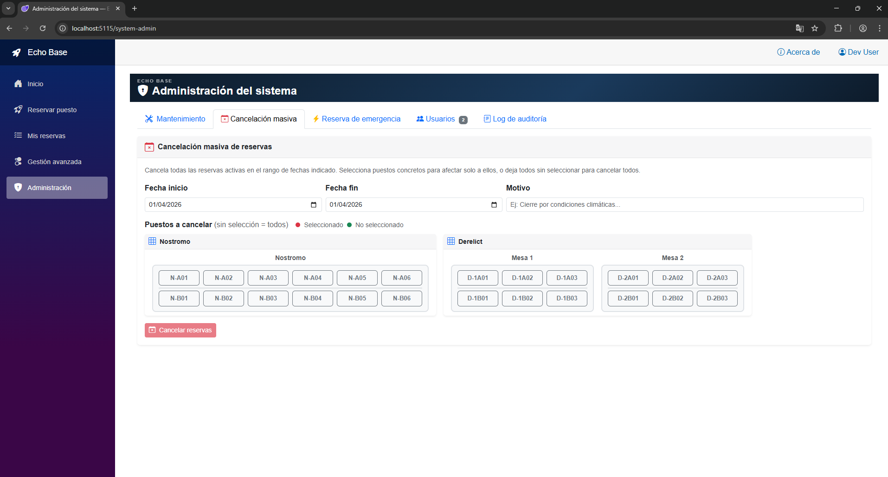

##### ⚡ Reserva de Emergencia
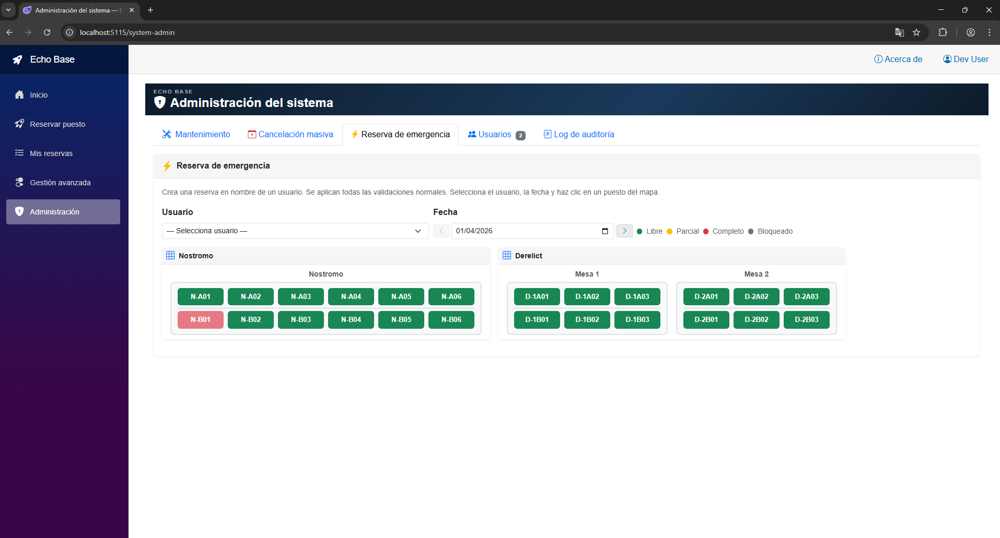

##### 👥 Gestión de Usuarios
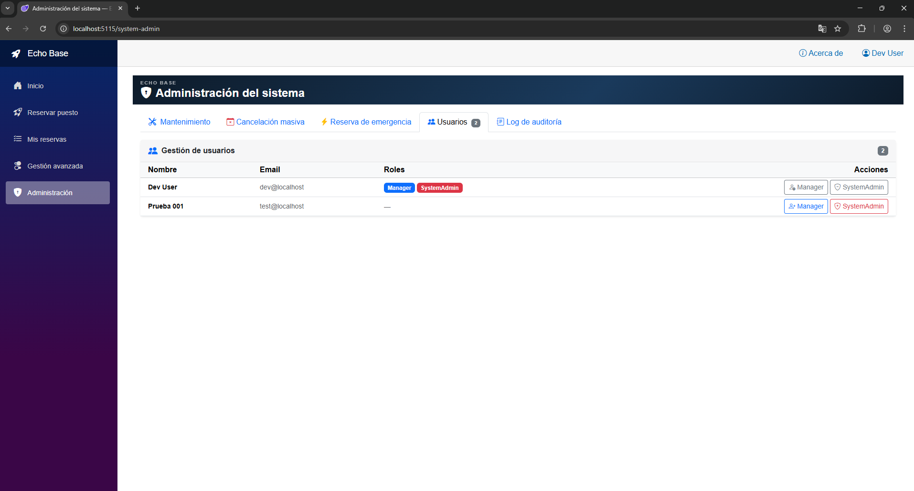

##### 📋 Log de Auditoría
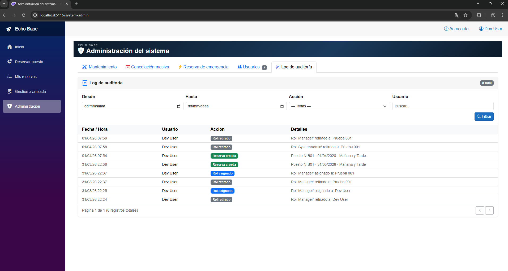

## 🗃️ Modelo de datos

### Entidades de negocio

#### `User` — Empleado
Representa a un empleado autenticado mediante Azure AD.

| Propiedad | Tipo | Descripción |
|---|---|---|
| `Id` | `Guid` (UUID v7) | Identificador único |
| `Name` | `string` | Nombre completo (sincronizado con Azure AD, solo lectura) |
| `Email` | `string` | Correo corporativo (sincronizado con Azure AD, solo lectura) |
| `BusinessLine` | `BusinessLine` (enum) | Línea de negocio: `Core`, `Energia`, `ScrapWaste`, `Transversal` |
| `PhoneNumber` | `string?` | Teléfono de contacto opcional |
| `EmailNotifications` | `bool` | Preferencia de notificación por correo (por defecto `true`) |
| `TeamsNotifications` | `bool` | Preferencia de notificación por Teams (por defecto `false`) |
| `Reservations` | nav. → `Reservation` | Reservas del usuario |
| `Roles` | nav. → `Role` | Roles de autorización asignados (relación muchos-a-muchos) |

> **Nota:** Las preferencias de notificación se persisten como columnas de `User` (no existe una tabla `UserPreferences` separada).

---

#### `Dock` — Puesto de trabajo
Puesto de trabajo físico reservable. Capacidad total del sistema: 24 puestos.

| Propiedad | Tipo | Descripción |
|---|---|---|
| `Id` | `Guid` (UUID v7) | Identificador único |
| `Code` | `string` | Código alfanumérico (ej.: `A-01`) |
| `Location` | `string` | Descripción de la ubicación física |
| `Equipment` | `string` | Equipamiento disponible (texto libre) |
| `DockZoneId` | `Guid?` | FK de la zona a la que pertenece el puesto |
| `DockZone` | nav. → `DockZone` | Zona a la que pertenece el puesto |
| `Reservations` | nav. → `Reservation` | Reservas realizadas sobre este puesto |

> **Nota:** El equipamiento se almacena como texto libre en `Dock.Equipment`; no existe una entidad `DockEquipment` separada.

---

#### `DockZone` — Zona de trabajo
Agrupa un conjunto de puestos bajo una misma zona física de la oficina.

| Propiedad | Tipo | Descripción |
|---|---|---|
| `Id` | `Guid` | Identificador único |
| `Name` | `string` | Nombre de la zona (`Nostromo`, `Derelict`) |
| `Description` | `string?` | Descripción opcional de la zona |
| `Docks` | nav. → `Dock` | Puestos de trabajo incluidos en la zona |

> **Nota:** La asignación puesto-zona se gestiona mediante la FK `Dock.DockZoneId`; no existe una entidad `DockZoneAssignment` separada.

---

#### `Reservation` — Reserva de puesto
Reserva de un puesto por un usuario en una fecha y franja horaria concretas.

| Propiedad | Tipo | Descripción |
|---|---|---|
| `Id` | `Guid` (UUID v7) | Identificador único |
| `UserId` | `Guid` | FK del usuario que realizó la reserva |
| `DockId` | `Guid` | FK del puesto de trabajo reservado |
| `Date` | `DateOnly` | Fecha de la reserva (sin componente horario) |
| `TimeSlot` | `TimeSlot` (enum) | Franja horaria: `Morning`, `Afternoon`, `Both` |
| `Status` | `ReservationStatus` (enum) | Estado: `Active`, `Cancelled` |
| `User` | nav. → `User` | Propietario de la reserva |
| `Dock` | nav. → `Dock` | Puesto reservado |

---

#### `BlockedDock` — Bloqueo de puesto
Bloqueo administrativo de un puesto para un período de fechas.

| Propiedad | Tipo | Descripción |
|---|---|---|
| `Id` | `Guid` (UUID v7) | Identificador único |
| `DockId` | `Guid` | FK del puesto bloqueado |
| `BlockedByUserId` | `Guid` | FK del Manager que creó el bloqueo |
| `StartDate` | `DateOnly` | Fecha de inicio del bloqueo (inclusiva) |
| `EndDate` | `DateOnly` | Fecha de fin del bloqueo (inclusiva) |
| `Reason` | `string` | Motivo del bloqueo |
| `IsActive` | `bool` | `true` mientras el bloqueo esté vigente; `false` si fue desactivado |
| `Dock` | nav. → `Dock` | Puesto bloqueado |
| `BlockedByUser` | nav. → `User` | Manager que realizó el bloqueo |

---

#### `Role` — Rol de autorización

| Propiedad | Tipo | Descripción |
|---|---|---|
| `Id` | `Guid` | Identificador único |
| `Name` | `string` | Nombre del rol: `BasicUser`, `Manager`, `SystemAdmin` |
| `Users` | nav. → `User` | Usuarios con este rol (relación muchos-a-muchos) |

> **Nota:** La relación `User` ↔ `Role` es muchos-a-muchos gestionada por EF Core; no existe una entidad `UserRole` separada.

Semillas de BD (`DbSeeder`):

| Nombre | Id semilla |
|---|---|
| `BasicUser` | `d0000000-0000-0000-0000-000000000001` |
| `Manager` | `d0000000-0000-0000-0000-000000000002` |
| `SystemAdmin` | `d0000000-0000-0000-0000-000000000003` |

---

#### `AuditLog` — Registro de auditoría
Entrada inmutable creada automáticamente por `AuditLoggingBehavior` para cada comando exitoso que implemente `IAuditableRequest`.

| Propiedad | Tipo | Descripción |
|---|---|---|
| `Id` | `Guid` (UUID v7) | Identificador único |
| `PerformedByUserId` | `Guid?` | FK del usuario que realizó la acción (`null` para acciones de sistema) |
| `Action` | `AuditAction` (enum) | Tipo de acción auditada |
| `Details` | `string` | Descripción legible (puesto, fecha, franja, etc.) |
| `Timestamp` | `DateTimeOffset` | Momento UTC de la acción |

Valores del enum `AuditAction`:

| Valor | Descripción |
|---|---|
| `ReservationCreated` | Reserva creada |
| `ReservationCancelled` | Reserva cancelada |
| `DockBlocked` | Puesto(s) bloqueado(s) |
| `DockUnblocked` | Puesto(s) desbloqueado(s) |
| `BulkReservationsCancelled` | Cancelación masiva ejecutada |
| `MaintenanceModeChanged` | Modo mantenimiento activado/desactivado |
| `EmergencyReservationCreated` | Reserva de emergencia creada |
| `UserRoleAssigned` | Rol asignado a un usuario |
| `UserRoleRemoved` | Rol retirado a un usuario |

---

#### `SystemSetting` — Configuración del sistema
Par clave-valor persistido para configuración en caliente sin redespliegue. La clave actúa como clave primaria (`string`); **excluida** del mecanismo UUID v7.

| Propiedad | Tipo | Descripción |
|---|---|---|
| `Key` | `string` (PK) | Clave única del ajuste |
| `Value` | `string` | Valor serializado como cadena |
| `UpdatedAt` | `DateTimeOffset` | Fecha y hora UTC de la última modificación |
| `UpdatedByUserId` | `Guid?` | FK del usuario que realizó la última modificación |

Claves predefinidas:

| Clave | Descripción |
|---|---|
| `"MaintenanceMode"` | `"true"` / `"false"` |
| `"MaintenanceModeReason"` | Texto libre (vacío si está desactivado) |

---

### Enums del dominio

| Enum | Valores |
|---|---|
| `BusinessLine` | `Core = 1`, `Energia = 2`, `ScrapWaste = 3`, `Transversal = 4` |
| `TimeSlot` | `Morning = 1` (hasta 14:00 h), `Afternoon = 2` (14:00 h – fin jornada), `Both = 3` (jornada completa) |
| `ReservationStatus` | `Active = 1`, `Cancelled = 2` |
| `AuditAction` | (ver tabla de `AuditLog` arriba) |

---

### Entidades planificadas (no implementadas)

Las siguientes entidades fueron contempladas en el diseño inicial pero aún no han sido implementadas:

| Entidad | Funcionalidad asociada |
|---|---|
| `IncidenceReport` | Funcionalidad 6: Reporte de incidencias en puestos de trabajo |
| `Report` / `ReportData` | Funcionalidad 5: Reportes y estadísticas |
| `Notification` | Notificaciones internas persistidas en la aplicación |


## 🔐 Modelo de autenticación y autorización
- **Autenticación**: Azure AD (Single Sign-On)
- **Roles/Claims**: BasicUser (puede reservar), Manager (puede reservar de modo normal y bloquear puestos)

Integración con Azure AD (tennant de nuestra compañía) para autenticación y autorización basada en roles. Los usuarios con rol "Manager" tendrán acceso a funcionalidades adicionales para bloquear puestos de trabajo.

## 📋 Reglas de negocio generales
- Un usuario solo puede reservar 1 puesto por día, y puede indicar la franja o franjas horarias en la que va a usar el puesto (mañanas hasta las 14 y tardes de 14 fin de jornada), de modo que otro empleado pueda reservar el puesto en una franja horaria diferente el mismo día si está disponible, pero un empleado puede reservar como máximo dos franjas horarias en el mismo puesto de trabajo o en dos puestos de trabajo distintos.
- Las reservas se abren con 7 días de antelación.
- Capacidad máxima: 24 puestos de trabajo
- Interfaz visual: Mapa de puestos de trabajo, agrupados en dos zonas: Nostromo tiene 12 puestos de trabajo en una mesa corrida con 6 puestos a cada lado, Derelict tiene 12 puestos de trabajo, en dos mesas corridas con 3 puestos a cada lado en cada una de las mesas
- Existirá un cuadro de mando para usuarios con privilegios de administración, que permitirá bloquear varios puestos de trabajo en un día o un período de días más largo, lo que bloqueará (impedirá reservar) esos puestos de trabajo para su reserva al resto de usuarios con privilegios normales.

## 👥 Funcionalidad 0: Gestión cuentas de usuario [Parcialmente implementada, pendiente de configuración de acceso al tennant de Azure AD]
- El sistema se integra con Azure AD para la autenticación de usuarios.
- Los usuarios se asignan automáticamente al rol "BasicUser" al iniciar sesión por primera vez.
- Un administrador puede asignar el rol "Manager" a usuarios específicos desde el portal de Azure AD, lo que les otorga privilegios adicionales para gestionar reservas y bloquear puestos de trabajo.

## ⚙️ Funcionalidad 1: Configuración de cuenta de usuario [Implementada]
- El usuario inicia sesión en la aplicación utilizando su cuenta de Azure AD.
- El usuario accede a su perfil de usuario desde un enlace persistente en la barra superior, identificado con su nombre de usuario autenticado.
- El perfil muestra los datos corporativos básicos sincronizados con Azure AD (nombre y correo) en modo de solo lectura.
- El usuario puede actualizar su línea de negocio y su número de teléfono de contacto desde su perfil.
- El usuario puede configurar sus preferencias de notificación (correo electrónico y, si está habilitada, Microsoft Teams) para recibir confirmaciones de reservas, cancelaciones y recordatorios.
- La edición del perfil se realiza en una pantalla dedicada, coherente con la UI principal de la aplicación, con feedback visual inmediato de guardado y validaciones básicas de entrada.
- La opción de configuración de notificaciones por Teams solo se muestra al usuario si el feature flag `Features:TeamsNotificationsEnabled` está activado. Si está desactivado, la tarjeta Teams desaparece de la pantalla de perfil y no se persiste la preferencia.

## 📌 Funcionalidad 2: Reserva de puesto de trabajo [Implementada]
- El usuario inicia sesión en la aplicación utilizando su cuenta de Azure AD.
- El usuario ve un mapa visual de los 24 puestos de trabajo, agrupados en dos zonas: Nostromo (12 puestos) y Derelict (12 puestos).
- El usuario selecciona un puesto de trabajo disponible para la fecha deseada.
- El usuario indica la franja horaria (mañana, tarde o ambas) para su reserva.
- El sistema valida que el usuario no tenga otra reserva para ese día y que el puesto esté disponible en la franja horaria seleccionada.
- El sistema confirma la reserva y muestra un resumen de la misma. El usuario puede cancelar la reserva desde el mismo resumen. El usuario recibe una notificación por correo electrónico o chat de Microsoft Teams (según configuración) confirmando la reserva.
- El mapa de bahías muestra información contextual en los tooltips de cada puesto:
  - **Libre**: "Libre — haz clic para reservar".
  - **Parcialmente reservado**: franja ocupada y nombre del usuario que la tiene reservada.
  - **Completo**: nombre(s) del/de los usuario(s) que tienen cada franja (mañana / tarde), diferenciados si son distintos.
  - **Bloqueado**: nombre del Manager que realizó el bloqueo y el motivo.
- Al abrir el modal de reserva de un puesto parcialmente ocupado, se indica explícitamente quién tiene reservada la franja ya ocupada.

## 🛡️ Funcionalidad 3: Cuadro de mando para administración [Implementada]
- Un usuario con rol de Manager inicia sesión en la aplicación.
- El Manager accede a un cuadro de mando que muestra el mapa de puestos de trabajo con la capacidad de seleccionar uno o varios puestos de trabajo.
- El Manager selecciona los puestos de trabajo que desea bloquear para un día específico o un período de días.
- El sistema bloquea los puestos de trabajo seleccionados, impidiendo que los usuarios con rol BasicUser puedan reservar esos puestos para las fechas bloqueadas.
- El Manager puede desbloquear los puestos de trabajo bloqueados desde el mismo cuadro de mando.
- El mapa de selección del cuadro de mando muestra en los tooltips quién tiene reservado cada puesto y en qué franja, diferenciando reservas de mañana y tarde con el nombre del reservador. Esto permite al Manager conocer el impacto sobre las reservas existentes antes de proceder al bloqueo.

## 🗓️ Funcionalidad 4: Gestión de reservas [Implementada]
- El usuario puede ver un historial de sus reservas pasadas y futuras.
- El usuario puede cancelar una reserva activa desde su historial en cualquier momento, sin restricción de antelación. Las cancelaciones de última hora son bienvenidas, ya que liberan el puesto para otros compañeros.
- El sistema envía notificaciones por correo electrónico al usuario para confirmar la creación, modificación o cancelación de una reserva.
- El sistema envía recordatorios automáticos a los usuarios sobre sus reservas próximas, con opciones para modificar o cancelar la reserva directamente desde la notificación.
- Las notificaciones por Microsoft Teams solo se envían si el feature flag `Features:TeamsNotificationsEnabled` está activo a nivel global (ver Funcionalidad 7).

## 📊 Funcionalidad 5: Reportes y estadísticas [Pendiente de implementación]
- El Manager puede acceder a un panel de reportes que muestra estadísticas de uso de los puestos de trabajo, como el porcentaje de ocupación por día, semana o mes.
- El Manager puede exportar los datos de reservas en formato CSV para análisis adicionales.
- El sistema genera alertas automáticas para el Manager si se detecta un patrón de reservas inusuales, como un aumento repentino en la demanda de ciertos puestos de trabajo o una alta tasa de cancelaciones.

## 🔧 Funcionalidad 6: Reporte de incidencias en los puestos de trabajo [Pendiente de implementación]
- El usuario puede reportar incidencias relacionadas con los puestos de trabajo (por ejemplo, problemas de equipamiento o limpieza) a través de la aplicación.
- El usuario selecciona el puesto de trabajo afectado y describe la incidencia en un formulario.
- El sistema registra la incidencia y notifica a los usuarios con rol de Manager para que puedan tomar medidas correctivas. El usuario recibe una confirmación de que su reporte ha sido registrado y se le informa sobre el proceso de seguimiento de la incidencia.
- El usuario puede hacer seguimiento del estado de su reporte de incidencia desde su perfil de usuario, recibiendo notificaciones sobre el progreso y la resolución de la incidencia.

## 🚩 Funcionalidad 7: Feature Flags de sistema [Implementada]

El sistema incluye un mecanismo de feature flags basado en configuración para activar o desactivar funcionalidades sin necesidad de redespliegue. Los flags se declaran en la sección `Features` de `appsettings.json` y pueden sobreescribirse en `appsettings.Development.json` o en las variables de entorno del host.

### 🔔 Flag: `Features:TeamsNotificationsEnabled`

| Valor | Comportamiento |
|---|---|
| `true` (por defecto) | Las notificaciones de Teams están activas. Se usa `GraphTeamsNotificationService` en producción o `LogTeamsNotificationService` con stubs de desarrollo. |
| `false` | Las notificaciones de Teams están completamente desactivadas. Se registra `NullTeamsNotificationService` (no-op) independientemente del entorno. El toggle de Teams desaparece de la pantalla de perfil de usuario y no se almacena la preferencia. |

**Alcance del flag:**
- **Infraestructura**: `ServiceCollectionExtensions.AddEchoBaseNotifications` lee el flag durante el arranque y registra la implementación apropiada de `ITeamsNotificationService`.
- **UI**: `UserProfile.razor` lee el flag en tiempo de ejecución para mostrar u ocultar el toggle de preferencias de Teams. Además, aunque el usuario tuviera previamente activada la preferencia, al guardar el perfil con el flag en `false` se persiste `false` para la preferencia de Teams.
- **Lógica de negocio**: Los handlers MediatR (`ReservationCreatedTeamsHandler`, `ReservationCancelledTeamsHandler`, `ReservationReminderTeamsHandler`) no tienen conocimiento del flag; simplemente llaman a `ITeamsNotificationService`, que en caso de flag desactivado es la implementación no-op.

**Configuración de referencia (`appsettings.json`):**
```json
{
  "Features": {
    "TeamsNotificationsEnabled": true
  }
}
```

**Para desactivar Teams en un entorno específico**, añadir a `appsettings.{Environment}.json`:
```json
{
  "Features": {
    "TeamsNotificationsEnabled": false
  }
}
```

**Tests unitarios:** `TeamsFeatureFlagTests` (en `EchoBase.Tests.Unit`) cubre:
- `NullTeamsNotificationService` completa sin efecto ni excepción.
- Con flag `false`, `AddEchoBaseNotifications` registra `NullTeamsNotificationService`.
- Con flag `false` y stubs activos, `NullTeamsNotificationService` sigue teniendo prioridad.
- Con flag `true` y stubs activos, se registra `LogTeamsNotificationService`.
- Con flag `true` y stubs desactivados, se registra `GraphTeamsNotificationService`.
- Sin flag declarado, el valor por defecto (`true`) preserva el comportamiento original.

## 🛠️ Funcionalidad 8: Funciones de administración del sistema [Implementada]
- El Administrador o administradores pueden gestionar los usuarios del sistema, asignar roles y revisar logs de auditoría para acciones críticas como reservas, cancelaciones y bloqueos de puestos de trabajo.
- El sistema registra en un log de auditoría todas las acciones relevantes, incluyendo quién realizó la acción, qué acción se realizó, detalles adicionales y la marca de tiempo. Este log es accesible para los administradores a través de una interfaz dedicada, con opciones de filtrado y exportación para análisis.
- El sistema incluye una función de "modo mantenimiento" que los administradores pueden activar para realizar tareas de mantenimiento sin afectar a los usuarios finales. Cuando el modo mantenimiento está activo, los usuarios reciben una notificación de que el sistema está temporalmente fuera de servicio y no pueden realizar reservas ni acceder a sus perfiles hasta que se desactive el modo mantenimiento.
- El sistema permite a los administradores cancelar reservas concretas y en masa para un día específico o un período de días, lo que es útil en situaciones como cierres de oficina por condiciones climáticas adversas o eventos especiales. Los usuarios afectados por la cancelación masiva reciben notificaciones individuales informándoles de la cancelación y el motivo.
- El sistema incluye una función de "reserva de emergencia" que los administradores pueden usar para reservar puestos de trabajo en nombre de los usuarios en situaciones excepcionales, como problemas técnicos o solicitudes urgentes. Esta función permite a los administradores seleccionar un usuario, un puesto de trabajo y una fecha, y realizar la reserva directamente desde el cuadro de mando de administración.

### Detalles de implementación

#### Rol SystemAdmin
- Semilla de BD: `Id = d0000000-0000-0000-0000-000000000003`, `Name = "SystemAdmin"`.
- Todos los comandos y queries protegidos verifican `UserHasRoleAsync(userId, "SystemAdmin")` via `IBlockedDockRepository`.
- En modo desarrollo, la clave `Authentication:DevUserIsSystemAdmin = true` en `appsettings.Development.json` asigna el rol SystemAdmin al usuario de desarrollo.

#### Modo de mantenimiento (`SystemSetting`)
La entidad `SystemSetting` (clave primaria: `Key: string`) persiste la configuración del sistema como pares clave/valor con auditoría:

| Clave | Descripción |
|---|---|
| `"MaintenanceMode"` | `"true"` / `"false"` |
| `"MaintenanceModeReason"` | Texto libre (vacío si desactivado) |

El handler `GetMaintenanceModeHandler` lee el ajuste completo (incluido `UpdatedAt` y `UpdatedByUserId`) con `GetSettingAsync`.

#### Log de auditoría (`AuditLog`)
La entidad `AuditLog` se genera automáticamente vía `AuditLoggingBehavior<TRequest, TResponse>` (pipeline de MediatR) cuando:
- La solicitud implementa `IAuditableRequest`, Y
- La respuesta es un `Result` o `Result<T>` con `IsSuccess = true`.

Valores del enum `AuditAction`:

| Valor | Descripción |
|---|---|
| `ReservationCreated` | Reserva creada |
| `ReservationCancelled` | Reserva cancelada |
| `DockBlocked` | Puesto(s) bloqueado(s) |
| `DockUnblocked` | Puesto(s) desbloqueado(s) |
| `BulkReservationsCancelled` | Cancelación masiva ejecutada |
| `MaintenanceModeChanged` | Modo mantenimiento activado/desactivado |
| `EmergencyReservationCreated` | Reserva de emergencia creada |
| `UserRoleAssigned` | Rol asignado a un usuario |
| `UserRoleRemoved` | Rol retirado a un usuario |

#### Comandos y queries implementados

| Artefacto | Ubicación |
|---|---|
| `SetMaintenanceModeCommand` | `EchoBase.Core/SystemAdmin/Commands/` |
| `BulkCancelReservationsCommand` | `EchoBase.Core/SystemAdmin/Commands/` |
| `CreateEmergencyReservationCommand` | `EchoBase.Core/SystemAdmin/Commands/` |
| `AssignUserRoleCommand` | `EchoBase.Core/SystemAdmin/Commands/` |
| `RemoveUserRoleCommand` | `EchoBase.Core/SystemAdmin/Commands/` |
| `GetMaintenanceModeQuery` | `EchoBase.Core/SystemAdmin/Queries/` |
| `GetAuditLogsQuery` | `EchoBase.Core/SystemAdmin/Queries/` |
| `AuditLoggingBehavior<,>` | `EchoBase.Core/SystemAdmin/` |

#### Página de administración
`/system-admin` (`SystemAdminDashboard.razor`) — requiere rol `SystemAdmin`. La página se organiza en **5 pestañas Bootstrap (`nav-tabs`)**; solo el contenido de la pestaña activa se renderiza. El log de auditoría carga sus datos de forma diferida (lazy) la primera vez que se selecciona la pestaña.

| Pestaña | Contenido |
|---|---|
| **Mantenimiento** | Activar / desactivar modo mantenimiento con motivo. Badge `ACTIVO` visible en la pestaña cuando está habilitado. |
| **Cancelación masiva** | Rango de fechas + motivo + mapa visual de puestos (mismo layout y estilos que `DockMap.razor`): los puestos actúan como botones toggle (`btn-outline-secondary` ↔ `btn-danger`); sin selección = cancelar todos. Contador de puestos seleccionados con botón "Limpiar selección". Diálogo de confirmación antes de ejecutar. |
| **Reserva de emergencia** | Selector de usuario + selector de fecha con flechas de navegación por días (recarga el mapa al cambiar). Mapa visual interactivo idéntico al de `DockMap.razor` (colores libres/parcial/completo/bloqueado, tooltips). Al hacer clic en un puesto disponible se abre un **modal** (mismo estilo que DockMap) con información del puesto, usuario seleccionado, selector de franja horaria (`btn-check`) y botón "Crear reserva". |
| **Usuarios** | Tabla de usuarios con sus roles actuales (badges de color). Botones de asignar/retirar rol **Manager** (`bi-person-plus` / `bi-person-dash`) y **SystemAdmin** (`bi-shield-plus` / `bi-shield-dash`). El texto del botón muestra el nombre completo del rol (`SystemAdmin`, no `Admin`). |
| **Log de auditoría** | Tabla paginada con filtros de fecha (desde/hasta), tipo de acción y nombre de usuario. Paginación con flechas. |


---

## 🧪 Estrategia de pruebas

### 🔬 Pruebas unitarias (`EchoBase.Tests.Unit`)

- **Framework:** xUnit + NSubstitute
- **Alcance:** Handlers MediatR de forma aislada; cada dependencia externa (repositorios, servicios de notificación) se sustituye por un doble de prueba con NSubstitute.
- **Cobertura actual:** Handlers de comandos/queries de Reservaciones, Usuarios y BlockedDocks; feature flags de Teams.

### 🔗 Pruebas de integración (`EchoBase.Tests.Integration`)

#### 🧰 Herramientas elegidas

| Capa | Decisión | Justificación |
|---|---|---|
| Framework de tests | xUnit (ya en uso) | Consistencia con el resto del proyecto; no se introduce nueva dependencia. |
| Base de datos | EF Core con **SQLite en memoria** (`Microsoft.Data.Sqlite`) | Misma librería ya referenciada en `EchoBase.Infrastructure`. Semántica SQL real (a diferencia del proveedor `InMemory` de EF Core, que no valida tipos ni restricciones). |
| Pipeline de negocio | **MediatR real** — sin mocks | Los tests ejercen el pipeline completo (validación, handler, notificaciones), de modo que cualquier regresión en el ensamblado de dependencias o en el flujo de un comando queda expuesta. |
| Servicios externos | Stubs no-operativos en `Infrastructure/Stubs/` | `NullEmailService` y `NullTeamsNotificationService` implementan las interfaces reales sin efecto secundario; permiten que los handlers de notificación se ejecuten sin SMTP ni Graph API. |
| Tiempo | `FrozenTimeProvider` | Subclase de `TimeProvider` congelada al inicio del día UTC. Hace deterministas las comprobaciones de "hoy" y "máximo 7 días vista". |

#### 🔒 Patrón de aislamiento

Cada clase de tests hereda de `IntegrationTestBase : IAsyncLifetime`.

- En `InitializeAsync`: se abre una `SqliteConnection("Data Source=:memory:")` y se mantiene abierta durante toda la vida del objeto. EF Core recibe esa conexión directamente con `UseSqlite(connection)`, lo que garantiza que el esquema persiste entre operaciones (las bases de datos SQLite en memoria se destruyen en cuanto se cierran todas sus conexiones).
- Se construye un contenedor DI con los repositorios reales, MediatR, stubs y `FrozenTimeProvider`.
- `DbSeeder.SeedAsync` puebla zonas y puestos de la configuración real; a continuación se insertan los tres usuarios de prueba específicos de los tests.
- En `DisposeAsync`: se libera el `DbContext`, el proveedor de servicios y la conexión SQLite.

Cada instancia de clase de tests obtiene su propia base de datos en memoria, por lo que los tests son completamente independientes entre sí.

#### ✅ Cobertura actual — Funcionalidad 2: Reserva de puesto de trabajo

**`CreateReservationIntegrationTests`** (9 casos):

| ID | Caso |
|---|---|
| IT-CR-01 | Solicitud válida → reserva persistida, devuelve Guid no vacío |
| IT-CR-02 | Fecha en el pasado → `ReservationErrors.DateInThePast` |
| IT-CR-03 | Fecha demasiado lejana (hoy + 8 días) → `ReservationErrors.DateTooFarAhead` |
| IT-CR-04 | Puesto inexistente → `ReservationErrors.DockNotFound` |
| IT-CR-05 | Puesto bloqueado por administración → `ReservationErrors.DockBlocked` |
| IT-CR-06 | Puesto ya reservado en ambas franjas → `ReservationErrors.DockNotAvailable` |
| IT-CR-07 | Usuario supera máximo de franjas diarias → `ReservationErrors.UserMaxSlotsExceeded` |
| IT-CR-08 | Dos usuarios reservan franjas complementarias (Mañana + Tarde) → ambas se persisten |
| IT-CR-09 | Usuario reserva franja `Both` → éxito, franja correcta almacenada |

**`CancelReservationIntegrationTests`** (4 casos):

| ID | Caso |
|---|---|
| IT-CA-01 | Propietario cancela reserva activa → estado pasa a `Cancelled` |
| IT-CA-02 | No propietario intenta cancelar → `ReservationErrors.NotReservationOwner`, reserva permanece activa |
| IT-CA-03 | Reserva ya cancelada → `ReservationErrors.AlreadyCancelled` |
| IT-CA-04 | Reserva no encontrada → `ReservationErrors.ReservationNotFound` |

#### ✅ Cobertura actual — Funcionalidad 8: Funciones de administración del sistema

**Pruebas unitarias**

**`SetMaintenanceModeTests`** (5 casos):

| ID | Caso |
|---|---|
| UT-SA-01 | AdminUserId con rol SystemAdmin → mode activado, devuelve `Result.Success` |
| UT-SA-02 | AdminUserId con rol SystemAdmin → mode desactivado, devuelve `Result.Success` |
| UT-SA-03 | `SetAsync` llamado con `MaintenanceModeKey` y valor `"true"` |
| UT-SA-04 | Al desactivar, `reason` almacenado como cadena vacía |
| UT-SA-05 | `AdminUserId` sin rol SystemAdmin → `SystemAdminErrors.NotSystemAdmin` |

**`BulkCancelReservationsTests`** (6 casos):

| ID | Caso |
|---|---|
| UT-SA-06 | Cancela todas las reservas activas del rango → devuelve `Result.Success(count)` |
| UT-SA-07 | Sin reservas en el rango → devuelve `Result.Success(0)` |
| UT-SA-08 | Filtro de DockId se pasa al repositorio correctamente |
| UT-SA-09 | No es SystemAdmin → `SystemAdminErrors.NotSystemAdmin` |
| UT-SA-10 | Fecha desde > hasta → `SystemAdminErrors.InvalidDateRange` |
| UT-SA-11 | Fecha desde == hasta → se procesa correctamente |

**`AssignRemoveUserRoleTests`** (9 casos):

| ID | Caso |
|---|---|
| UT-SA-12 | Asignar rol `"Manager"` a usuario existente → éxito |
| UT-SA-13 | Rol `"Manager"` queda en la colección del usuario |
| UT-SA-14 | Asignar siendo no SystemAdmin → `SystemAdminErrors.NotSystemAdmin` |
| UT-SA-15 | Asignar rol inválido → `SystemAdminErrors.InvalidRole` |
| UT-SA-16 | Asignar a usuario no encontrado → `SystemAdminErrors.UserNotFound` |
| UT-SA-17 | Asignar rol ya asignado → `SystemAdminErrors.RoleAlreadyAssigned` |
| UT-SA-18 | Eliminar rol existente → éxito |
| UT-SA-19 | Eliminar rol no asignado → `SystemAdminErrors.RoleNotAssigned` |
| UT-SA-20 | Eliminar siendo no SystemAdmin → `SystemAdminErrors.NotSystemAdmin` |

**`CreateEmergencyReservationTests`** (11 casos):

| ID | Caso |
|---|---|
| UT-SA-21 | Franja `Morning` → reserva creada, devuelve `Result.Success(Guid)` |
| UT-SA-22 | Franja `Afternoon` → reserva creada |
| UT-SA-23 | Franja `Both` → reserva creada |
| UT-SA-24 | `ITeamsNotificationService` notificado al usuario destinatario |
| UT-SA-25 | No es SystemAdmin → `SystemAdminErrors.NotSystemAdmin` |
| UT-SA-26 | Fecha en el pasado → `ReservationErrors.DateInThePast` |
| UT-SA-27 | Fecha a más de 7 días → `ReservationErrors.DateTooFarAhead` |
| UT-SA-28 | Fecha exactamente hoy (límite inferior) → éxito |
| UT-SA-29 | Puesto no encontrado → `ReservationErrors.DockNotFound` |
| UT-SA-30 | Puesto bloqueado → `ReservationErrors.DockBlocked` |
| UT-SA-31 | Puesto ya reservado en ambas franjas → `ReservationErrors.DockNotAvailable` |

**`AuditLoggingBehaviorTests`** (7 casos):

| ID | Caso |
|---|---|
| UT-SA-32 | Solicitud auditable + `Result.Success` → `AuditLogRepository.AddAsync` llamado |
| UT-SA-33 | Solicitud auditable + `Result<Guid>.Success` → entrada de auditoría registrada |
| UT-SA-34 | Solicitud auditable + `Result.Failure` → no se registra auditoría |
| UT-SA-35 | Solicitud auditable + `Result<Guid>.Failure` → no se registra |
| UT-SA-36 | Solicitud NO auditable → `AddAsync` nunca llamado |
| UT-SA-37 | Behavior no altera la respuesta del handler |
| UT-SA-38 | Timestamp de la entrada proviene del `TimeProvider` |

**`AuditDetailsReservationTests`** (4 casos — `EchoBase.Tests.Unit/Reservations/`):

| ID | Caso |
|---|---|
| UT-AD-01 | `CreateReservationCommand` con `ResolvedDockCode` → `Details` contiene código, fecha y franja legible (Mañana/Tarde/Mañana y Tarde); no contiene el GUID |
| UT-AD-02 | `CreateReservationCommand` sin resolución → fallback al GUID del puesto |
| UT-AD-03 | `CancelReservationCommand` con `ResolvedAuditDetails` → `Details` contiene texto enriquecido; GUID de reserva ausente |
| UT-AD-04 | `CancelReservationCommand` sin resolución → fallback al GUID de la reserva |

**`AuditDetailsAdminCommandsTests`** (8 casos — `EchoBase.Tests.Unit/SystemAdmin/`):

| ID | Caso |
|---|---|
| UT-AD-05 | `BlockDocksCommand` con `ResolvedDockCodes` → `Details` contiene códigos, fechas y motivo; no contiene GUIDs |
| UT-AD-06 | `BlockDocksCommand` sin resolución → fallback a conteo de puestos |
| UT-AD-07 | `CreateEmergencyReservationCommand` con resolución → `Details` contiene código puesto, nombre usuario y franja legible |
| UT-AD-08 | `CreateEmergencyReservationCommand` sin resolución → fallback a GUIDs de puesto y usuario |
| UT-AD-09 | `AssignUserRoleCommand` con `ResolvedTargetUserName` → `Details` contiene nombre del usuario; GUID ausente |
| UT-AD-10 | `AssignUserRoleCommand` sin resolución → fallback al GUID del usuario |
| UT-AD-11 | `RemoveUserRoleCommand` con `ResolvedTargetUserName` → `Details` contiene nombre del usuario; GUID ausente |
| UT-AD-12 | `RemoveUserRoleCommand` sin resolución → fallback al GUID del usuario |

**Pruebas de integración**

**`SetMaintenanceModeIntegrationTests`** (5 casos):

| ID | Caso |
|---|---|
| IT-SA-01 | Activar → `SystemSetting` con `Key = "MaintenanceMode"` y valor `"true"` persistido |
| IT-SA-02 | Activar luego desactivar → valor pasa a `"false"`, reason vacío |
| IT-SA-03 | Activar y consultar `GetMaintenanceModeQuery` → DTO correcto con `IsActive`, `Reason`, `UpdatedAt`, `UpdatedByUserId` |
| IT-SA-04 | No SystemAdmin → `SystemAdminErrors.NotSystemAdmin` |
| IT-SA-05 | Activar → entrada de auditoría con `Action = MaintenanceModeChanged` persistida |

**`BulkCancelReservationsIntegrationTests`** (6 casos):

| ID | Caso |
|---|---|
| IT-SA-06 | Dos reservas en rango → ambas canceladas, devuelve `Result.Success(2)` |
| IT-SA-07 | Sin reservas en rango → devuelve `Result.Success(0)` |
| IT-SA-08 | Cancela solo el rango especificado (reserva fuera de rango intacta) |
| IT-SA-09 | Filtro de puesto → solo cancela la reserva de ese puesto |
| IT-SA-10 | No SystemAdmin → `SystemAdminErrors.NotSystemAdmin` |
| IT-SA-11 | Fecha desde > hasta → `SystemAdminErrors.InvalidDateRange` |

**`CreateEmergencyReservationIntegrationTests`** (5 casos):

| ID | Caso |
|---|---|
| IT-SA-12 | Solicitud válida → reserva persistida con `UserId` y `DockId` correctos |
| IT-SA-13 | No SystemAdmin → `SystemAdminErrors.NotSystemAdmin` |
| IT-SA-14 | Fecha en el pasado → `ReservationErrors.DateInThePast` |
| IT-SA-15 | Puesto no encontrado → `ReservationErrors.DockNotFound` |
| IT-SA-16 | Puesto ya reservado en Both → `ReservationErrors.DockNotAvailable` |

**`AuditLogIntegrationTests`** (6 casos):

| ID | Caso |
|---|---|
| IT-SA-17 | Comando exitoso → entrada de auditoría persistida en BD |
| IT-SA-18 | Comando fallido (no SystemAdmin) → no se escribe entrada |
| IT-SA-19 | Dos comandos → dos entradas, ordenadas por `Timestamp` descendente |
| IT-SA-20 | Filtro por `Action` devuelve solo los registros coincidentes |
| IT-SA-21 | Paginación: solicitar página 2 devuelve los registros correctos |
| IT-SA-22 | Filtro por nombre de usuario devuelve solo entradas de ese usuario |